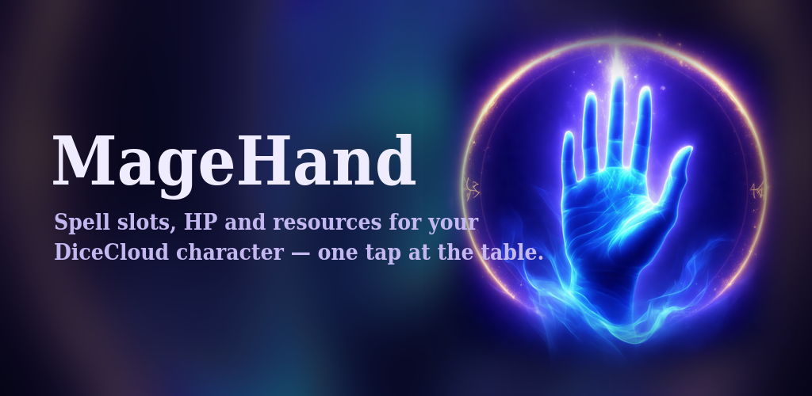
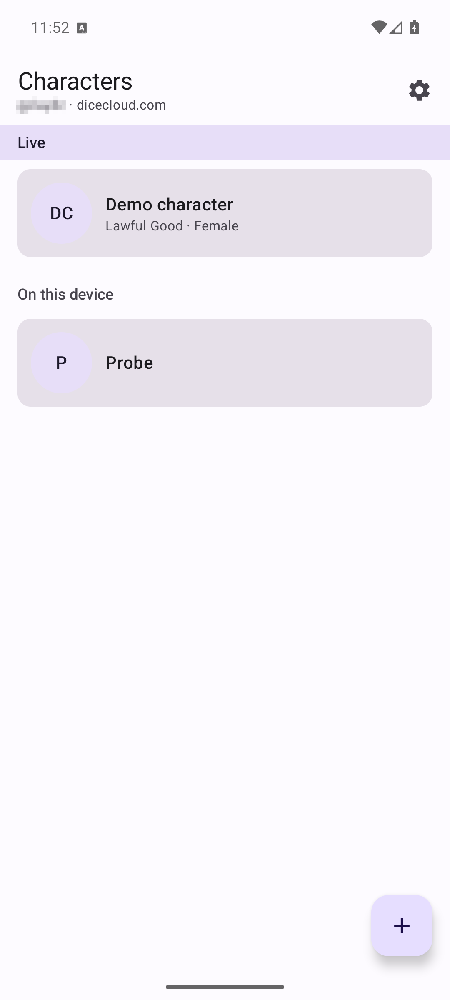
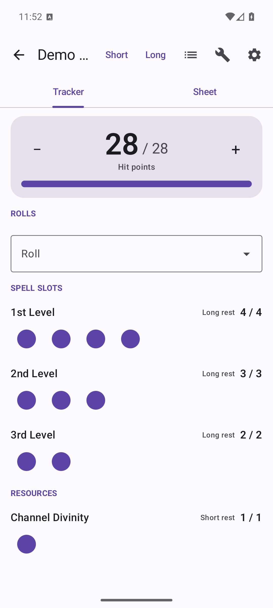
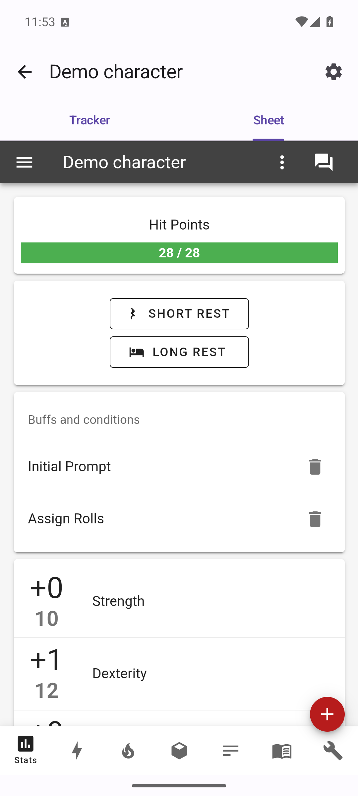
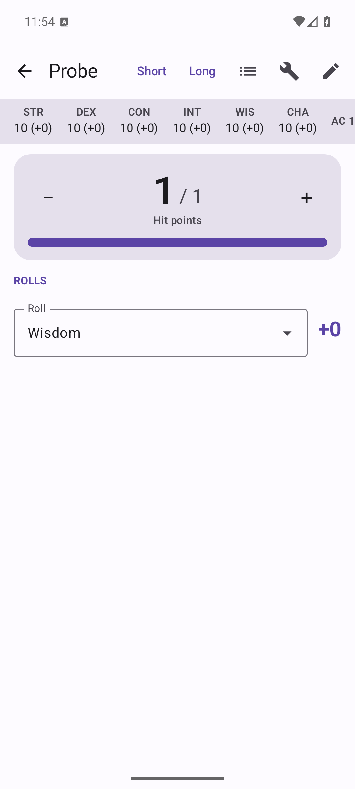
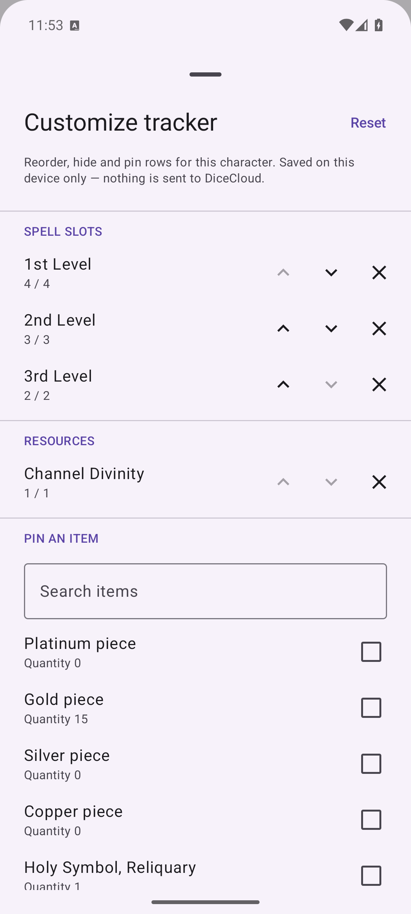

# MageHand

An Android companion app for [DiceCloud v2](https://dicecloud.com) character sheets,
built for the game table.

<p>
  
</p>

**One screen with the things you actually touch mid-session**: spell slots as tappable
pips, class resources (rage, ki, wild shape, inspiration), hit points with quick
damage/heal, and pinned consumable items. One tap spends, every tap has undo, and a
history sheet shows what changed. Short/long rest buttons reset everything whose reset
rule matches — the same operations the DiceCloud UI itself performs.

<br clear="left">



## Features

- **Tracker** — auto-discovered from your character's properties: spell slots,
  resources, HP, pinned items. Reorder, pin and hide rows per character; layout stays
  on your device.
- **Rolls reference** — pick a skill, save or ability check from one dropdown and the
  app shows the modifier it resolves to, advantage and disadvantage included. It gives
  you the number; the dice stay on the table.
- **Local characters** — a tracker without a DiceCloud account at all. Create a
  character on the device with level, ability scores, max HP and AC, then add the spell
  slots, resources and items you want on its tracker. Stored on the device only.
- **Full sheet & character creator** — the DiceCloud PWA embedded with automatic
  sign-on, so the app always matches your server's features.
- **Live** — DDP (Meteor websocket) subscriptions keep the tracker in sync in real
  time; writes are optimistic with rollback, rate-limited to the server's own limits.
- **Offline read** — the last-synced sheet stays viewable without a connection.
- **Works with your server** — dicecloud.com by default, or any self-hosted
  DiceCloud v2 server over HTTPS.
- **Nothing else** — no ads, no analytics, no tracking, no accounts of its own.
  Exactly two Android permissions: `INTERNET`, `ACCESS_NETWORK_STATE`.
  [Privacy policy](https://hashtagchow.github.io/magehand/).

## Screenshots

| | |
|---|---|
|  |  |
| Server characters and device-local ones in one list. | The tracker: HP, rolls, spell slot pips, resources. |
|  |  |
| Pick a roll, read the modifier. | The full DiceCloud sheet, signed in automatically. |
|  |  |
| A local character: ability reference strip, HP, rolls. | Reorder, hide and pin rows per character. |

The full set — including the local-character editor and settings — is in
[`screenshots/`](screenshots/).

## Architecture

Four Gradle modules:

| Module | What |
|---|---|
| `:app` | Jetpack Compose UI, WebView SSO, navigation |
| `:core:model` | Pure Kotlin domain types |
| `:core:ddp` | Pure JVM DDP/Meteor client over OkHttp websockets — no Android dependencies, fully unit-testable |
| `:core:data` | Repositories, Room cache, Hilt DI, Android Keystore token storage, tracker engine, serial write queue |

All server writes go over DDP (DiceCloud has no REST write endpoints); reads use DDP
subscriptions live and `GET /api/creature/:id` for snapshots. Session tokens are stored
AES-GCM-encrypted via the Android Keystore.

## Building

```
export JAVA_HOME=<path to JDK 21> ANDROID_HOME=<path to Android SDK>
./gradlew test assembleDebug
```

Requires JDK 21 and Android SDK platform 37. Release builds assemble unsigned unless
you provide your own keystore (`keystore/signing.properties`, see
`app/build.gradle.kts` — env-var overrides `MAGEHAND_KEYSTORE_*` are also supported).

Some tests feed on a large recorded character capture that is not part of this
repository; they skip automatically when it is absent. The `MAGEHAND_IT=1` live
integration probes need a real server — endpoints and credentials come from
`MAGEHAND_IT_*` environment variables (see the test sources).

## Status

On Google Play (internal/closed testing). The tracker, sheet SSO, rests, undo/history,
per-character customization, local characters and the rolls reference are table-tested.

## License

[GPL-3.0](LICENSE) — the same license as DiceCloud itself. Copyright © 2026
hashtagchow. MageHand is an independent client and is not
affiliated with the DiceCloud project.
